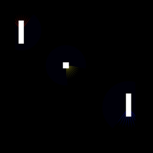

# PinPongBar

Classic tennis bar game but with Tcp functionalities

## The game
Two players will connect by a locally and start a new game.
The game will try to emulate the classic ping pong / tennis retro black and white game playing against each other.
It will be donde with the cocos2d-x c++ game engine and be available for android and iOS.

Project done by Juan Casado Ballesteros

[Mr.BlissfulGrin](http://www.mrblissfulgrin.com "mrblissfulgrin")

[Cocos2d-x c++ game engine](http://www.cocos2d-x.org "Cocos2d-x c++ game engine")

